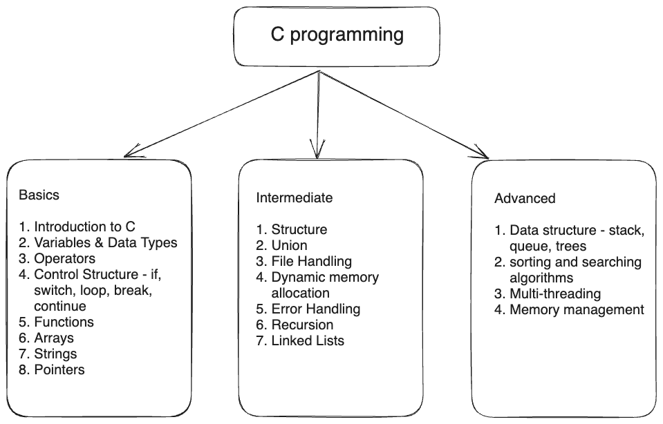

# C programming



## Table of Contents

1. [1. Basic C Programming Topics](#1-basic-c-programming-topics)
   - [1.1 Translator Program](#11-program-translator-program)  
   - [1.2 Algorithm and Flowchart](#12-algorithm-and-flowchart)  
   - [1.3 Introduction to C program](#13-introduction-to-c-programming)
   - [1.4 First C program and its parts](#14-first-c-program-ans-its-various-parts)  
   - [1.5 Comments and Escape sequences](#15-comments-and-escape-sequences)  
   - [1.6 Keywords, Variables, Data types](#16-keywords-variables-data-types)  
   - [1.7 Input and output functions](#17-input-and-output-functions)  
   - [1.8 Operators](#18-operators)  
   - [1.9 <math.h> library](#19-mathh-library)  
   - [1.10 Control Statement](#110-control-statement)  
   - [1.11 Arrays](#111-arrays)  
2. [2. Intermediate C]()
   - []()
3. [3. Advanced C](#basic-c)
   - []()

## 1. Basic C Programming Topics

### 1.1 Program? Translator Program?

A program is a set of instructions to perfrom a task.

A translator program is a software tool that translates source code to object code (machine code / binary code). It ranslates code or instructions from one programming language into another. It plays a crucial role in the software development process, enabling developers to write code in high-level languages that are easier to understand and maintain, while the translator converts it into machine code that a computer can execute. There are several types of translator programs, each serving a specific purpose in this process:

1. **Compiler:**
   - **Purpose:** A compiler translates the entire source code of a program written in a high-level language into machine code or another lower-level language in one go. It generates an executable file that can run independently.
   - **Examples:** GCC (GNU Compiler Collection) for C/C++, javac for Java.

2. **Interpreter:**
   - **Purpose:** An interpreter executes code line by line, translating and executing each line on the fly. It doesn't produce an independent executable; instead, it directly interprets and executes the source code.
   - **Examples:** Python interpreter, JavaScript interpreter in web browsers.

3. **Assembler:**
   - **Purpose:** An assembler translates assembly language code into machine code. Assembly language is a low-level human-readable language that corresponds closely to the architecture of a specific computer's CPU.
   - **Examples:** NASM (Netwide Assembler) for x86 assembly.

4. **Linker:**
   - **Purpose:** A linker is responsible for combining multiple object files or libraries generated by a compiler into a single executable file. It resolves references between different parts of a program.
   - **Examples:** ld (GNU Linker), Microsoft Linker (link.exe).

5. **Loader:**
   - **Purpose:** A loader loads an executable program into memory so that it can be executed by the CPU. It also performs necessary memory allocation and relocation.
   - **Examples:** The operating system's loader component.

6. **Preprocessor:**
   - **Purpose:** A preprocessor is a tool that processes the source code before compilation. It handles directives and macros, performs text substitution, and prepares the code for the compiler.
   - **Examples:** The C/C++ preprocessor, which handles `#include` and `#define` directives.

7. **Transpiler (Source-to-Source Compiler):**
   - **Purpose:** A transpiler translates code from one high-level programming language into another high-level programming language. It is often used for migrating codebases or converting code to be compatible with different platforms or frameworks.
   - **Examples:** Babel (JavaScript transpiler), TypeScript compiler (TypeScript to JavaScript).

8. **Cross-Compiler:**
   - **Purpose:** A cross-compiler is designed to generate code for a different target platform or architecture than the one it runs on. This is often used in embedded systems development.
   - **Examples:** ARM cross-compiler, used for developing software for ARM-based microcontrollers on x86-based computers.

9. **Decompiler:**
   - **Purpose:** A decompiler attempts to reverse the process of compilation by translating machine code or executable files back into a higher-level programming language or assembly language. This is often used for reverse engineering and analysis of binaries.
   - **Examples:** IDA Pro, Hex-Rays (for reverse engineering).

Each type of translator program serves a specific role in the software development process, from converting human-readable code into machine code to managing dependencies and loading the program into memory for execution. The choice of which type of translator to use depends on the programming language, target platform, and development requirements.

### 1.2 Algorithm and Flowchart

- [Visit this page to check examples of Algorithm and flowchart](https://engineerstutor.com/2018/08/27/examples-of-algorithms-and-flow-charts-with-c-code/)

An algorithm is a set of well-defined, step-by-step instructions for solving a specific problem or accomplishing a particular task. It serves as a blueprint for a computer program, and it can be implemented in various programming languages. Algorithms are essential in computer science, as they help solve problems efficiently and predictably.

A flowchart is a visual representation of an algorithm that uses various shapes and symbols to represent different elements of the algorithm, such as inputs, processes, decisions, and outputs. Flowcharts make it easier to understand and communicate how an algorithm works, both for programmers and non-programmers. They are commonly used for documenting, planning, and designing algorithms before writing actual code.

Here are some key concepts related to algorithms and flowcharts:

**Algorithms:**

1. **Problem Definition:** Begin by clearly defining the problem or task you want to solve.

2. **Input and Output:** Identify the inputs (data or information required) and the expected outputs (results).

3. **Steps:** Break down the solution into a sequence of steps, each of which performs a specific operation.

4. **Decisions:** Include conditional statements (if-else) for making choices or decisions within the algorithm.

5. **Loops:** Use loops (for, while) for repeating a set of steps when necessary.

6. **Pseudocode:** Before creating a flowchart or writing code, often, it's helpful to describe the algorithm in a high-level, human-readable language called pseudocode.

7. **Efficiency:** Consider the efficiency and performance of the algorithm, aiming for the most efficient solution.

**Flowcharts:**

1. **Start and End:** Every flowchart begins with a "Start" symbol and ends with an "End" symbol.

2. **Processes:** Use rectangular boxes to represent the processing steps or operations in the algorithm.

3. **Decision Points:** Represent decision points (e.g., if-else statements) with diamond-shaped symbols.

4. **Input/Output:** Use parallelograms to denote input and output operations.

5. **Arrows:** Connect the symbols with arrows to indicate the flow of control or data from one step to another.

6. **Flow Control:** Use arrows with labels (e.g., "Yes" or "No") to indicate the direction of flow based on decisions.

7. **Connectors:** Sometimes, you may need to use connectors (small circles) to link different parts of the flowchart.

8. **Annotations:** Add comments and explanations to clarify the purpose of specific steps or decisions.

To create a flowchart for an algorithm, you can use specialized software or even pen and paper. Flowcharts help in visualizing the logic of an algorithm and are valuable tools for designing, documenting, and communicating the solution to others.

While flowcharts are useful for illustrating algorithms, the actual implementation of the algorithm is done through programming languages like C, Java, Python, etc. The flowchart serves as a visual guide to help translate the algorithm into code.

### 1.3 Introduction to C programming

- C is a general-purpose mid-level programming language, a widely-used and influential programming language that was developed in the early 1970s at Bell Labs by Dennis Ritchie.

Here are some key aspects of C programming and reasons why C has been important:

- Efficiency: C is known for its efficiency and low-level control over hardware, making it an ideal choice for system programming, embedded systems, and developing software that requires high performance.

- Standard Library: C provides a rich standard library that includes functions for tasks like file I/O, memory management, string manipulation, and more. This standard library simplifies common programming tasks and allows developers to create efficient programs without reinventing the wheel.

- Learning and Teaching: Mother of Programming language. C is often recommended as a first programming language for beginners because it teaches fundamental programming concepts, such as variables, loops, and functions, in a clear and concise manner. Learning C provides a solid foundation for understanding other programming languages.

- C has been used to write everything from operating systems (including Windows and many others) to complex programs like the Python interpreter, Git, Oracle database, and more.

#### Environment Setup

- code editor (VSCode/Codeblock) and compiler (gcc)

### 1.4 First C program ans its various parts

```c
#include <stdio.h>
int main()
{
  printf("hello world");
  return 0;
}
```

- Let's break down the code to understand each line:

  - #include <stdio.h> The function used for generating output is defined in stdio.h. In order to use the printf function, we need to first include the required file, also called a header file.

  - int main() The main() function is the entry point to a program. Curly brackets { } indicate the beginning and end of a function (also called a code block). The statements inside the brackets determine what the function does when executed.

### 1.5 Comments and Escape sequences

In C programming, comments and escape sequences are important for code documentation and character representation. It also help for debugging and leave explanation of codes. Here's an explanation of each:

**Comments:**

Comments in C are used to provide explanations or descriptions within the code. They are ignored by the compiler and serve as documentation for programmers. C provides two types of comments:

1. **Single-Line Comments:** Single-line comments begin with `//` and continue to the end of the line. They are often used for short explanations on a single line.

   ```c
   // This is a single-line comment
   ```

2. **Multi-Line Comments:** Multi-line comments are enclosed between `/*` and `*/`. They can span multiple lines and are often used for longer explanations.

   ```c
   /* This is a
      multi-line comment */
   ```

Example of comments in C code:

   ```c
   #include <stdio.h>

   int main() {
      // This is a single-line comment
      printf("Hello, World!\n"); // This comment is at the end of the line

      /* This is a
         multi-line comment */
      
      return 0;
   }
   ```

**Escape Sequences:**

Escape sequences are special character combinations that are used to represent characters that are not directly typable or printable. They begin with a backslash `\` followed by a character. Here are some common escape sequences in C:

- `\n`: Newline character.
- `\t`: Tab character.
- `\"`: Double quotation mark.
- `\'`: Single quotation mark.
- `\\`: Backslash.

Escape sequences are often used when you need to insert special characters into strings, such as newline characters to format text or escape quotation marks within a string.

Example of escape sequences in C code:

   ```c
   #include <stdio.h>

   int main() {
      printf("This is a newline: \n");
      printf("This is a tab: \t");
      printf("This is a double quote: \"\n");
      printf("This is a single quote: \'\n");
      printf("This is a backslash: \\\n");

      return 0;
   }
   ```

When you run the code, you will see that the escape sequences are interpreted and displayed as the corresponding special characters.

### 1.6 Keywords, Variables, Data types

- Tokens of any programming language: keywords, identifiers, data types, operators, special symbols, string.

In C programming, you'll work with keywords, variables, and various data types to create programs. Here's an overview of these fundamental concepts:

#### **Keywords:**

Keywords are reserved words in C that have special meanings and are used to define the structure and logic of the program. You cannot use keywords as identifiers (variable or function names). Some common C keywords include:

auto       double     int        struct
break      else       long       switch
case       enum       register   typedef
char       extern     return     union
const      float      short      unsigned
continue   for        signed     void
default    goto       sizeof     volatile
do         if         static     while

- `int`: Defines an integer data type.
- `char`: Defines a character data type.
- `float`: Defines a floating-point data type.
- `double`: Defines a double-precision floating-point data type.
- `if`: Used for conditional statements.
- `else`: Used in conjunction with `if` for alternative actions.
- `while`: Used to create loops.
- `for`: Used for loop control.
- `switch`: Used for multi-way branching.
- `return`: Specifies the return value of a function.
- `break`: Exits a loop or a `switch` statement.
- `continue`: Jumps to the next iteration of a loop.
- `void`: Indicates that a function returns no value.

#### **Variables:**

Variables are used to store and manipulate data within a C program. When declaring a variable, you specify its data type, a name, and an optional initial value. Variable names must be unique within a scope (a block of code). Examples of variable declarations:

- `int age;` (Declares an integer variable named `age`.)
- `float salary = 5000.50;` (Declares a floating-point variable named `salary` and assigns it an initial value.)
- `char initial = 'A';` (Declares a character variable named `initial` and assigns it the character 'A'.)

Naming conventions and rules for variables in C are essential for writing readable and maintainable code. They help developers understand the purpose of variables and ensure consistency across projects. Here are some common naming conventions and rules for variables in C:

**Variable Naming Rules:**

1. **Valid Characters:** Variable names can consist of letters (both uppercase and lowercase), digits, and underscores. They must start with a letter or an underscore. C is case-sensitive, so `myVariable` and `myvariable` are considered different names.

2. **Reserved Keywords:** Variable names cannot be the same as C reserved keywords (e.g., `int`, `if`, `while`). Avoid using these keywords as variable names.

3. **No Special Characters:** Avoid using special characters like `@`, `$`, or `%` in variable names. Stick to letters, numbers, and underscores.

4. **Length:** Variable names can be as long as necessary, but it's a good practice to keep them reasonably short and descriptive.

**Variable Naming Conventions:**

1. **Use Descriptive Names:** Choose variable names that clearly convey the purpose of the variable. For example, use `counter` instead of `c` for a counter variable.

2. **Camel Case:** For multi-word variable names, use camel case. Start with a lowercase letter, and capitalize the first letter of each subsequent word. For example, `myVariableName`.

3. **Meaningful Names:** Make sure variable names reflect the data they hold. For example, use `studentName` instead of `name` for a student's name.

4. **Avoid Single Letters:** Generally, avoid using single letters (except for loop counters) as variable names. This improves code readability.

5. **Constants:** If a variable is a constant (a value that does not change), use uppercase letters with underscores to separate words. For example, `MAX_VALUE`.

6. **Prefixes and Suffixes:** You can use prefixes or suffixes to indicate variable types. For example, `strName` for a string and `nCount` for an integer count.

7. **Avoid Ambiguity:** Ensure your variable names are not ambiguous. For example, if you have both `customerName` and `customerAddress`, it's clear what they represent.

8. **Consistency:** Maintain a consistent naming style across your codebase. If you start with camel case, continue with camel case.

**Examples:**

   ```c
   // Good variable naming examples
   int numberOfStudents;
   char studentName[50];
   const int MAX_ATTEMPTS = 3;

   // Avoid using single letters and cryptic names
   int n; // Avoid using single letters like 'n'
   int x; // Avoid cryptic variable names

   // Meaningful names and clear intent
   double temperatureCelsius;
   char customerAddress[100];

   // Consistent style and camel case
   int totalSalesCount;
   ```

Adhering to these naming conventions and rules will improve the readability and maintainability of your C code and make it easier for you and other developers to understand and work with your programs.

#### **Data Types:**

C provides several built-in data types, allowing you to store different types of data in variables. Common data types include:

1. **Integer Data Types:**
   - `int`: Used to store whole numbers.
   - `short`: Used for short integers.
   - `long`: Used for long integers.
   - `long long`: Used for very long integers.
   - `signed` and `unsigned`: Modifiers to specify whether the integer can be negative or non-negative.

   In C, the memory allocated for integer data types like `int`, `short`, `long`, and `long long` can vary depending on the specific implementation (compiler and system). However, there are general guidelines and common memory sizes associated with these data types on most systems.

      Here's an example of integer data types and their common memory sizes:

      **`int`:**
         - Common memory size: 4 bytes (32 bits)
         - Typical range: -2,147,483,648 to 2,147,483,647

      ```c
      int myInt; // Declaration of an integer variable
      ```

      **`short` (or `short int`):**
         - Common memory size: 2 bytes (16 bits)
         - Typical range: -32,768 to 32,767

      ```c
      short myShort; // Declaration of a short integer variable
      ```

      **`long`:**
         - Common memory size: 4 bytes (32 bits) or 8 bytes (64 bits, on 64-bit systems)
         - Typical range: -2,147,483,648 to 2,147,483,647 (32-bit), or -9,223,372,036,854,775,808 to 9,223,372,036,854,775,807 (64-bit)

      ```c
      long myLong; // Declaration of a long integer variable
      ```

      **`long long` (or `long long int`):**
         - Common memory size: 8 bytes (64 bits)
         - Typical range: -9,223,372,036,854,775,808 to 9,223,372,036,854,775,807

      ```c
      long long myLongLong; // Declaration of a long long integer variable
      ```

      **`signed` and `unsigned`:**
         - These qualifiers can be used with integer data types to specify whether the values are signed (can be positive or negative) or unsigned (only non-negative).

      ```c
      signed int mySignedInt;       // A signed integer can store positive and negative
      unsigned int myUnsignedLongLong; // An unsigned can store only positive values

      #include <stdio.h>

      int main() {
         signed int positiveNumber = 42;
         signed int negativeNumber = -10;

         printf("Positive Number: %d\n", positiveNumber);
         printf("Negative Number: %d\n", negativeNumber);

         return 0;
      }
      ```

      Please note that the actual memory sizes and ranges can vary depending on the specific compiler and system architecture (32-bit vs. 64-bit). You can use the `sizeof` operator in C to determine the size of data types on your system:

      ```c
      printf("Size of int: %lu bytes\n", sizeof(int));
      printf("Size of short: %lu bytes\n", sizeof(short));
      printf("Size of long: %lu bytes\n", sizeof(long));
      printf("Size of long long: %lu bytes\n", sizeof(long long));
      ```

      This code will output the sizes of these data types on your specific system.

2. **Floating-Point Data Types:**
   - `float`: Used for single-precision floating-point numbers.
   - `double`: Used for double-precision floating-point numbers.
   - `long double`: Used for extended precision floating-point numbers.

      In C, the memory allocated for floating-point data types like `float`, `double`, and `long double` can also vary depending on the specific implementation (compiler and system). However, there are general guidelines and common memory sizes associated with these data types on most systems.

      Here's an example of floating-point data types and their common memory sizes:

      **`float`:**
         - Common memory size: 4 bytes (32 bits)
         - Typical range: Approximately 3.4e-38 to 3.4e38

      ```c
      float myFloat; // Declaration of a floating-point variable
      ```

      **`double`:**
         - Common memory size: 8 bytes (64 bits)
         - Typical range: Approximately 1.7e-308 to 1.7e308

      ```c
      double myDouble; // Declaration of a double-precision floating-point variable
      ```

      **`long double`:**
         - Common memory size: 8 bytes (64 bits) or 16 bytes (128 bits, on some systems)
         - Typical range: Similar to `double` but with greater precision

      ```c
      long double myLongDouble; // Declaration of a long double floating-point variable
      ```

      Please note that the actual memory sizes and ranges can vary depending on the specific compiler and system architecture (32-bit vs. 64-bit). You can use the `sizeof` operator in C to determine the size of data types on your system, as shown in the previous answer.

      Here's how you can determine the size of `float`, `double`, and `long double` on your system:

      ```c
      printf("Size of float: %lu bytes\n", sizeof(float));
      printf("Size of double: %lu bytes\n", sizeof(double));
      printf("Size of long double: %lu bytes\n", sizeof(long double));
      ```

      In C, data type modifiers are used to alter the storage size and sign of the data type. These modifiers can help control memory allocation and the range of values that a variable can hold. Here are some commonly used data type modifiers in C and how they affect memory allocation:

      1. **`short` and `long` Modifiers**:
         - `short`: This modifier is used to reduce the storage size of an integer data type. For example, `short int` is typically 2 bytes, which is smaller than a standard `int`.
         - `long`: This modifier is used to increase the storage size of an integer data type. For example, `long int` is typically 4 or 8 bytes, providing a larger range of values.

      2. **`signed` and `unsigned` Modifiers**:
         - `signed`: This modifier is the default for integer data types. It allows variables to store both positive and negative values. For example, `int` is implicitly signed.
         - `unsigned`: This modifier is used to make an integer data type capable of storing only non-negative values, effectively doubling the positive range. For example, `unsigned int` can store values from 0 to 65,535 instead of -32,768 to 32,767 for a standard `int`.

      3. **`const` Modifier**:
         - The `const` modifier is used to declare a constant, meaning the value of the variable cannot be changed once it's assigned. While this modifier doesn't directly affect memory allocation, it can help the compiler optimize code by placing constants in read-only memory segments.

      4. **`volatile` Modifier**:
         - The `volatile` modifier is used to indicate that a variable's value can be changed by external factors not under the program's control. This modifier prevents the compiler from optimizing away accesses to the variable and can affect memory allocation in the sense that it may lead to actual memory accesses.

      5. **`register` Modifier**:
         - The `register` modifier is used to suggest that a variable should be stored in a processor register for faster access. While it doesn't explicitly control memory allocation, it can improve performance by reducing memory accesses.

      These modifiers provide flexibility and control over memory allocation and variable behavior in C. When choosing which modifier to use, consider the specific requirements of your program, the range of values needed, and any optimization considerations.

3. **Character Data Type:**
   - `char`: Used to store a single character.

   In C, character data is represented using the `char` data type. Here's an example of using the `char` data type to declare character variables and store character values:

   ```c
   #include <stdio.h>

   int main() {
      // Declaring and initializing character variables
      char grade = 'A'; // Single character
      char firstInitial = 'J';
      char lastInitial = 'D';

      // Displaying character variables
      printf("Grade: %c\n", grade);
      printf("First Initial: %c\n", firstInitial);
      printf("Last Initial: %c\n", lastInitial);

      // Character values can also be assigned as integer ASCII values
      char letter = 65; // ASCII value for 'A'

      // Displaying character values as integers
      printf("Character as an integer: %d\n", letter);

      return 0;
   }
   ```

   In this example: We declare character variables `grade`, `firstInitial`, and `lastInitial` and initialize them with character values. We use the `%c` format specifier to print character values. We can also assign character values using their corresponding ASCII values. The ASCII value of 'A' is 65. We display a character as an integer using the `%d` format specifier. When you run this code, you'll see the character values and their corresponding ASCII values printed to the console. Character variables are useful for working with individual characters, such as letters, digits, and symbols, in C programs.

4. **Derived Data Types:**
   - `arrays`: Collections of variables of the same type.
   - `structures`: User-defined data types grouping variables of different data types.
   - `unions`: Like structures but share memory space for variables.
   - `pointers`: Used to store memory addresses.
   - `enum`: Defines a set of named integer constants.

5. **Void Data Type:**
   - `void`: Represents the absence of type. Used when a function doesn't return a value.

Example of variable declarations with data types:

   ```c
   int age;
   double salary = 5000.50;
   char initial = 'A';
   int numbers[5]; // Array of integers
   struct Person {
      char name[50];
      int age;
   };
   typedef enum { RED, GREEN, BLUE } Color;
   ```

These fundamental concepts are essential for understanding and writing C programs, as they govern how data is stored, processed, and manipulated within the language.

#### Format specifiers

In C are used in the `printf` and `scanf` functions to define the type and format of the data that you want to display or read. They specify how data should be formatted when it's input or output. Here are some commonly used format specifiers in C:

1. **Integer Types:**

   - `%d`: Print or scan an `int`.
   - `%u`: Print or scan an `unsigned int`.
   - `%ld`: Print or scan a `long`.
   - `%lu`: Print or scan an `unsigned long`.
   - `%lld`: Print or scan a `long long`.
   - `%llu`: Print or scan an `unsigned long long`.
   - `%x` or `%X`: Print or scan an integer in hexadecimal.
   - `%o`: Print or scan an integer in octal.

2. **Floating-Point Types:**

   - `%f`: Print or scan a `float`.
   - `%lf`: Print or scan a `double`.
   - `%Lf`: Print or scan a `long double`.
   - `%e` or `%E`: Print or scan in scientific notation.
   - `%g` or `%G`: Print or scan in either `%f` or `%e`, depending on the value.

3. **Characters:**

   - `%c`: Print or scan a character.
   - `%s`: Print or scan a string.

4. **Pointers:**

   - `%p`: Print an address from a pointer.

5. **Size Specifiers:**

   - `%zd`: Print or scan a `size_t`.
   - `%td`: Print or scan a `ptrdiff_t`.

6. **Special Characters:**

   - `%%`: Print a percent sign.

7. **Width and Precision:**

   - `%[width]d`: Print an integer with a minimum field width of `[width]`.
   - `%.[precision]f`: Print a floating-point number with `[precision]` decimal places.

8. **Other Format Specifiers:**

   - `%n`: Used with `printf` to count the number of characters printed.
   - `%*`: Used to specify the width or precision as a variable argument.

Here's an example demonstrating the use of format specifiers in `printf`:

   ```c
   #include <stdio.h>

   int main() {
      int number = 4234;
      float floatValue = 3.14159;
      char letter = 'A';
      char name[20];

      printf("Integer: %d\n", number); // 4234
      printf("Integer: %2d\n", number); // 42
      printf("Float: %*f\n", floatValue); // 3.1
      printf("Float: %.2f\n", floatValue); // 3.14
      printf("Float: %3.2f\n", floatValue); // 3.14
      printf("Character: %c\n", letter);


      scanf("%3d %d %*f %5s", &number, &number, &floatValue, text); /* input: 4234  3.7  anisul */
      printf("%d  %d  %s", number, number, text); /* output: 423  4234  anisu */ 

      return 0;
   }
   ```

   This code prints an integer with `%d`, a floating-point number with two decimal places using `%.2f`, and a character with `%c`. These format specifiers are placeholders that `printf` will replace with the actual values you provide as arguments.

### 1.7 Input and output functions

We can use printf(), puts(), putchar() for output and scanf(), gets(), getchar() for input.

#### printf and scanf()

In C, you can get user input from the standard input, typically the keyboard, using the `scanf` function. Here's how you can use `scanf` to read user input:

   ```c
   #include <stdio.h>

   int main() {
      int number;
      char name[50];

      // Prompt the user for input
      printf("Enter an integer: ");
      scanf("%d", &number);

      printf("Enter your name: ");
      scanf("%s", name); // Reads a single word (stops at whitespace)

      // Display the input
      printf("You entered: %d\n", number);
      printf("Your name is: %s\n", name);

      return 0;
   }
   ```

   In this example:

   1. We declare two variables, `number` to store an integer and `name` as a character array to store a name.

   2. We use `printf` to prompt the user for input.

   3. We use `scanf` to read the input. The format specifier `%d` is used to read an integer, and `%s` is used to read a string (which stops at whitespace). The `&` symbol is used before the variable name to provide the address of the variable where the input should be stored.

   4. After reading the input, we use `printf` to display the values entered by the user.

   When you run the program, the user will be prompted to enter an integer and their name. The values entered by the user are then displayed.

   Keep in mind that `scanf` can be sensitive to the input format, and it's a good practice to perform error checking on the return value of `scanf` to ensure that the input was successfully read.

#### gets and puts

- The `gets` function is used to read a line of text from the user.
- The `puts` function is used to display a string.

   ```c
   #include <stdio.h>

   int main() {
      char name[50];

      printf("Enter your name: ");
      gets(name); // Read a line of text (be cautious, gets is unsafe)

      printf("Hello, ");
      puts(name); // Display the name using puts

      return 0;
   }
   ```

Please note that `gets` is considered unsafe because it doesn't limit the number of characters read, potentially causing a buffer overflow. It's recommended to use `fgets` instead for safe input.

The `fgets` function is commonly used for reading lines of text from the user while ensuring safety by specifying the maximum number of characters to read. Here's an example using `fgets`:

   ```c
   #include <stdio.h>

   int main() {
      char name[50]; // Buffer to store the input

      printf("Enter your name: ");
      fgets(name, sizeof(name), stdin); // Read a line of text safely

      // Remove the newline character if present
      size_t len = strlen(name); // size_t is commonly used when dealing with memory allocation, dynamic arrays, and buffer sizes because it ensures that sizes are non-negative and can accommodate the largest possible size on a given system.

      if (name[len - 1] == '\n') {
         name[len - 1] = '\0';
      }

      printf("Hello, %s!\n", name); // Display the name

      return 0;
   }
   ```

   In this example:

   1. We declare a character array `name` to store the input.

   2. We use `printf` to prompt the user for input.

   3. We use `fgets` to read a line of text. The `sizeof(name)` specifies the maximum number of characters to read to avoid buffer overflow. `stdin` indicates that input should come from the standard input (keyboard).

   4. After reading the input, we check if a newline character is present at the end of the string and remove it if necessary to ensure proper formatting.

   5. Finally, we use `printf` to display the name.

   The use of `fgets` is recommended over `gets` for reading lines of text because it is safer and allows you to specify the maximum number of characters to read, preventing buffer overflow issues.

#### getchar() and putchar()

- The `getchar` function is used to read a single character from the user.
- The `putchar` function is used to display a character.

   ```c
   #include <stdio.h>

   int main() {
      char character;

      printf("Enter a character: ");
      character = getchar(); // Read a single character

      printf("You entered: ");
      putchar(character); // Display the character using putchar
      putchar('\n'); // Add a newline character

      return 0;
   }
   ```

#### Input-output related programs

- Conversion between ASCII characters and ASCII Value

```c
// Convert ASCII characters to ASCII Value
#include <stdio.h>
int main(){
  char asciiCharacter;
  printf("Enter any character: ");
  scanf("%c",&asciiCharacter);
//   asciiCharacter = getchar();
  printf("The equivalent ascii value: %d\n", asciiCharacter);
}

// Convert ASCII Value to ASCII characters
#include <stdio.h>
int main(){
  int asciiValue;
  printf("Enter any ASCII value: ");
  scanf("%d", &asciiValue);
  printf("The equivalent ascii character: %c\n", asciiValue);
}
```

- Conversion between lowercase and uppercase letter

```c
#include <stdio.h>
int main(){
  char lowercaseLetter;

  printf("Enter a lowercase letter: ");
  scanf("%c", &lowercaseLetter);

  printf("Equivalent uppercase letter: %c\n", lowercaseLetter-32);

  getchar();
}

#include <stdio.h>
int main(){
  char uppercaseLetter;

  printf("Enter a uppercase letter: ");
  scanf("%c", &uppercaseLetter);

  printf("Equivalent lowercase letter: %c\n", uppercaseLetter+32);

  getchar();
}

// using library function
#include <stdio.h>
#include <ctype.h>
int main(){
  char uppercaseLetter, lowercaseLetter;

  printf("Enter a uppercase letter: ");
  scanf("%c", &uppercaseLetter);

  lowercaseLetter = tolower(uppercaseLetter);

  printf("Equivalent lowercase letter: %c\n", lowercaseLetter);

  getchar();
}

#include <stdio.h>
#include <ctype.h>
int main(){
  char uppercaseLetter, lowercaseLetter;

  printf("Enter a lowercase letter: ");
  scanf("%c", &lowercaseLetter);

  uppercaseLetter = toupper(lowercaseLetter);

  printf("Equivalent uppercase letter: %c\n", uppercaseLetter);

  getchar();
}
```

- Conversion between binary, decimal, octal and hexa-decimal numbers

```c

```

### 1.8 Operators

- There are 3 important types in C. Unary Operators, Binary Operators, ternary operator.

#### 1.9.1 Unary Operators

Unary operators in C are operators that perform operations on a single operand (a single variable or value). Here are some common unary operators with examples:

**1. Unary Plus `+`:** This operator doesn't change the sign of a value. It's often not explicitly used because positive values are the default.

```c
int x = 5;
int y = +x; // y is 5, the same as x
```

**2. Unary Minus `-`:** This operator changes the sign of a value to its negative.

```c
int x = 7;
int y = -x; // y is -7, the negative of x
```

**3. Increment `++`:** This operator increases the value of a variable by 1.

```c
int x = 10;
x++; // Increment x by 1, now x is 11
```

**4. Decrement `--`:** This operator decreases the value of a variable by 1.

```c
int x = 8;
x--; // Decrement x by 1, now x is 7
```

**5. Logical NOT `!`:** This operator negates a logical (boolean) value. It converts a true value to false and vice versa.

```c
int condition = 0;
int negatedCondition = !condition; // negatedCondition is 1 (true)
```

**6. Bitwise NOT `~`:** This operator performs a bitwise NOT operation, inverting all bits of an integer value.

```c
int x = 5; // Binary: 00000101
int y = ~x; // Binary: 11111010, y is -6 in decimal
```

**7. Sizeof `sizeof`:** This operator returns the size in bytes of a data type or an expression.

```c
int size = sizeof(int); // size is the size of an int (typically 4 bytes)
```

These unary operators are essential in C programming for tasks like incrementing or decrementing variables, changing signs, and performing logical or bitwise operations on data.

#### 1.9.2 Binary Operators

- operators precedence: *, / , % then +, -

**1. Arithmetic Operators:**

- Addition `+`: Adds two values.

     ```c
     int sum = 5 + 3; // sum is 8
     ```

- Subtraction `-`: Subtracts one value from another.

     ```c
     int difference = 10 - 3; // difference is 7
     ```

- Multiplication `*`: Multiplies two values.

     ```c
     int product = 4 * 5; // product is 20
     ```

- Division `/`: Divides one value by another.

     ```c
     float quotient = 15.0 / 4.0; // quotient is 3.75
     ```

- Modulus `%`: Returns the remainder of a division operation.

     ```c
     int remainder = 15 % 4; // remainder is 3
     ```

##### C Program: create a basic calculator

```c
// create a basic calculator
#include <stdio.h>
#include <ctype.h>
int main(){
  int num1, num2, result;
  float div;

  printf("Enter num1 = ");
  scanf("%d", &num1);

  printf("Enter num2 = ");
  scanf("%d", &num2);

  result = num1 + num2;
  printf("%d + %d = %d\n",num1,num2,result);

  result = num1 - num2;
  printf("%d - %d = %d\n",num1,num2,result);

  result = num1 * num2;
  printf("%d * %d = %d\n",num1,num2,result);

  div = (float)num1 / num2; // data type casting here
  printf("%d / %d = %.2f\n",num1,num2,div);

  result = num1 % num2;
  printf("%d %% %d = %d\n",num1,num2,result);

  getchar();
}

```

##### C Program: sum and average of 3 numbers

```c
#include <stdio.h>
#include <ctype.h>
int main(){
  int num1, num2, num3, sum;
  float average;

  printf("Enter num1 = ");
  scanf("%d", &num1);

  printf("Enter num2 = ");
  scanf("%d", &num2);

  printf("Enter num3 = ");
  scanf("%d", &num3);

  sum = num1 + num2 + num3;
  printf("%d + %d + %d = %d\n",num1,num2,num3,sum);

  average = (float)sum/3;
  printf("Average = %.2f\n",average);  

  getchar();
}
```

##### C Program: Area of triangle

```c
#include <stdio.h>
#include <ctype.h>
int main(){
  float base, height, area;
  
  printf("Enter base = ");
  scanf("%f", &base);

  printf("Enter height = ");
  scanf("%f", &height);

  area = 0.5*base*height;
  printf("Area of triangle = %.2f\n",area);

  getchar();
}
```

##### C Program: Area of triangle given 3 sides

```c
// Let ABC be a triangle such that the length of the 3 sides of the triangle is AB = c, BC = a and CA = b.

// The semi-perimeter of triangle ABC = s = (a + b + c)/2

// Then, the area of triangle ABC = √[s × (s – a) × (s – b) × (s – c)].
#include <stdio.h>
#include <ctype.h>
#include <math.h>
int main(){
  float side1, side2, side3, semiPerimeter, areaWith3Sides;
  
  printf("Enter side1 = ");
  scanf("%f", &side1);

  printf("Enter side2 = ");
  scanf("%f", &side2);

  printf("Enter side3 = ");
  scanf("%f", &side3);

  semiPerimeter = (side1 + side2 + side3) / 2;

  areaWith3Sides = sqrt(semiPerimeter * (semiPerimeter-side1) * (semiPerimeter-side2) * (semiPerimeter-side3) );

  printf("Area of triangle with 3 sides = %.2f\n",areaWith3Sides);

  getchar();
}
```

##### C Program: Area of Circle

##### C Program: Temperature converter

```c
// Centigrade to Farhrenheit
#include <stdio.h>
#include <ctype.h>
int main(){
  float centigrade, fahrenheit;
  
  printf("Enter centigrade = ");
  scanf("%f", &centigrade);

  fahrenheit = (centigrade * 1.8) + 32;

  printf("Equivalent Fahrenheit = %.2f\n",fahrenheit);

  getchar();
}

// Farhrenheit to Centigrade
#include <stdio.h>
#include <ctype.h>
int main(){
  float centigrade, fahrenheit;
  
  printf("Enter fahrenheit = ");
  scanf("%f", &fahrenheit);

  centigrade = (fahrenheit - 32) / 1.8;

  printf("Equivalent centigrade = %.2f\n",centigrade);

  getchar();
}
```

**2. Relational Operators:**

- Equal `==`: Tests if two values are equal.

     ```c
     int isEqual = (5 == 5); // isEqual is 1 (true)
     ```

- Not Equal `!=`: Tests if two values are not equal.

     ```c
     int isNotEqual = (3 != 5); // isNotEqual is 1 (true)
     ```

- Greater Than `>`: Tests if one value is greater than another.

     ```c
     int isGreater = (8 > 3); // isGreater is 1 (true)
     ```

- Less Than `<`: Tests if one value is less than another.

     ```c
     int isLess = (2 < 5); // isLess is 1 (true)
     ```

**3. Logical Operators:**

- Logical AND `&&`: Returns true if both conditions are true.

     ```c
     int bothTrue = (1 && 1); // bothTrue is 1 (true)
     ```

- Logical OR `||`: Returns true if at least one condition is true.

     ```c
     int eitherTrue = (0 || 1); // eitherTrue is 1 (true)
     ```

- Logical NOT `!`: Returns the opposite of a condition.

     ```c
     int notTrue = !1; // notTrue is 0 (false)
     ```

**4. Assignment Operator:**

Assignment operators in C are used to assign values to variables. They also allow you to perform operations while assigning values to variables. Here are some common assignment operators with more detailed examples:

- Simple Assignment (`=`):** Assigns the value on the right side to the variable on the left side.

```c
int x = 5; // Assigns the value 5 to variable x
```

- Addition Assignment (`+=`):** Adds the value on the right to the variable on the left and assigns the result to the variable on the left.

```c
int x = 5;
x += 3; // Equivalent to x = x + 3; x is now 8
```

**3. Subtraction Assignment (`-=`):** Subtracts the value on the right from the variable on the left and assigns the result to the variable on the left.

```c
int x = 10;
x -= 4; // Equivalent to x = x - 4; x is now 6
```

- Multiplication Assignment (`*=`):** Multiplies the variable on the left by the value on the right and assigns the result to the variable on the left.

```c
int x = 3;
x *= 2; // Equivalent to x = x * 2; x is now 6
```

- Division Assignment (`/=`):** Divides the variable on the left by the value on the right and assigns the result to the variable on the left.

```c
int x = 12;
x /= 4; // Equivalent to x = x / 4; x is now 3
```

- Modulus Assignment (`%=`):** Calculates the remainder of the division of the variable on the left by the value on the right and assigns the result to the variable on the left.

```c
int x = 15;
x %= 7; // Equivalent to x = x % 7; x is now 1
```

- Bitwise Assignment Operators (e.g., `&=`, `|=`, `^=`):** Perform bitwise operations on the variable on the left and the value on the right, then assign the result to the variable on the left.

These assignment operators provide a concise way to update variables by performing arithmetic and bitwise operations simultaneously. They are commonly used to update variables in loops and other situations where values need to be incremented, decremented, or modified in place.

**5. Bitwise Operators (e.g., `&`, `|`, `^`, `<<`, `>>`):**

Bitwise operators in C are used to manipulate individual bits of integer values. They perform bit-level operations, which are especially useful for tasks like setting or clearing specific bits in flags or working with binary data. Here are some common bitwise operators with examples:

**1. Bitwise AND `&`:** Performs a bitwise AND operation, which returns 1 for each bit position where both operands have a 1.

```c
int a = 5;    // Binary: 00000101
int b = 3;    // Binary: 00000011
int result = a & b; // Binary: 00000001, result is 1
```

**2. Bitwise OR `|`:** Performs a bitwise OR operation, which returns 1 for each bit position where at least one operand has a 1.

```c
int a = 5;    // Binary: 00000101
int b = 3;    // Binary: 00000011
int result = a | b; // Binary: 00000111, result is 7
```

**3. Bitwise XOR `^`:** Performs a bitwise XOR (exclusive OR) operation, which returns 1 for each bit position where only one operand has a 1.

```c
int a = 5;    // Binary: 00000101
int b = 3;    // Binary: 00000011
int result = a ^ b; // Binary: 00000110, result is 6
```

**4. Bitwise NOT `~`:** Performs a bitwise NOT operation, which inverts each bit (0 to 1 and 1 to 0) in a value.

```c
int a = 5;    // Binary: 00000101
int result = ~a;  // Binary: 11111010, result is -6 in decimal
```

**5. Left Shift `<<`:** Shifts the bits of a value to the left by a specified number of positions.

```c
int a = 5;    // Binary: 00000101
int result = a << 2; // Binary: 00010100, result is 20
```

**6. Right Shift `>>`:** Shifts the bits of a value to the right by a specified number of positions. For signed numbers, it fills with the sign bit (arithmetic right shift).

```c
int a = 16;   // Binary: 00010000
int result = a >> 2; // Binary: 00000100, result is 4
```

Bitwise operators are commonly used for low-level operations, such as setting or clearing flags in registers, packing and unpacking data in binary formats, or implementing algorithms that require bit manipulation.

#### 1.9.3 Ternary Operator

Ternary operators in C are a shorthand way of writing simple conditional statements. They allow you to evaluate an expression and return a value based on whether the expression is true or false. The ternary operator is also known as the conditional operator and has the following syntax:

```c
condition ? value_if_true : value_if_false
```

The `condition` is evaluated first. If it's true, the `value_if_true` is returned; otherwise, the `value_if_false` is returned. Here's an example:

```c
int x = 10;
int y = (x > 5) ? 20 : 5; // If x is greater than 5, y is assigned 20; otherwise, y is assigned 5.
```

In this example, `x > 5` is the condition. If `x` is greater than 5 (which it is in this case), the value `20` is assigned to `y`. If the condition were false, the value `5` would be assigned to `y`.

Ternary operators are useful when you want to assign a value to a variable based on a simple condition. They can make your code more concise, especially for short conditional assignments, and are often used within larger expressions or when initializing variables.

#### Operators related program

1. Write a program that add 2 integers/floating point number.
2. Write a program that add, subtract, multiply, divide 2 integers/floating point number.
3. Write algorithm, flowchart and c program that calculate the area of a triangle.
4. Write algorithm, flowchart and c program that calculate the area of a triangle, 3 sides length are given.
5. Write A,F,C program that calculate the area of a rectangle.
6. Write A,F,C program that calculate the area of a circle.
7. Write A,F,C program that convert the Celsius temperature to Fahrenheit.
8. Write A,F,C program that convert the Fahrenheit temperature to Celsius.
9. Write A,F,C program that swaps 2 numbers.
10. Write A,F,C program that calculate (a+b)^2 formula; take the values for a and b from user.

### 1.9 <math.h> library

In C, you can use the math library, which provides a wide range of mathematical functions for various calculations. To use functions from the math library, you need to include the `<math.h> or <stdlib.h>` header. Here's an example that demonstrates how to use some common math library functions:

   ```c
   #include <stdio.h>
   #include <math.h>
   #include <stdlib.h>

   int main() {
      // Calculating square root
      double number = 25.0;
      double squareRoot = sqrt(number);
      printf("Square root of %lf is %lf\n", number, squareRoot);

      // Calculating power
      double base = 2.0;
      double exponent = 3.0;
      double result = pow(base, exponent);
      printf("%lf raised to the power of %lf is %lf\n", base, exponent, result);

      // Calculating absolute value
      int value = -10;
      int absoluteValue = abs(value);
      printf("The absolute value of %d is %d\n", value, absoluteValue);

      // Rounding functions
      double floatingNumber = 3.456;
      double roundedDown = floor(floatingNumber);
      double roundedUp = ceil(floatingNumber);
      printf("Original: %lf, Rounded Down: %lf, Rounded Up: %lf\n", floatingNumber, roundedDown, roundedUp);

      return 0;
   }
   ```

In this example, we include `<math.h>` and use functions like `sqrt()`, `pow()`, `abs()`, `floor()`, and `ceil()` to perform various mathematical calculations. These functions are just a subset of what the math library provides. You can explore more functions for advanced mathematical operations, such as trigonometry, logarithms, and exponential functions.

   ```c
      #include <stdio.h>
      #include <ctype.h>
      #include <stdlib.h>
      int main(){
      int number, absoluteNumber;
      
      printf("Enter any negative number = ");
      scanf("%d", &number);

      absoluteNumber = abs(number);

      printf("abs(%d) = %d\n",number, absoluteNumber);

      getchar();
      }
   ```

### 1.10 Control Statement

#### 1.10.1 Conditional control Statement

Conditional control statements in C are used to control the flow of a program based on conditions. They allow you to execute different code blocks based on whether a condition is true or false. There are primarily two types of conditional control statements in C: `if` and `switch`. Here are examples for both:

##### `if` Statement:**

The `if` statement is used to execute a block of code if a specified condition is true. If the condition is false, the code block is skipped.

   ```c
   #include <stdio.h>

   int main() {
      int x = 10;

      if (x > 5) {
         printf("x is greater than 5.\n");
      } else {
         printf("x is not greater than 5.\n");
      }

      return 0;
   }
   ```

In this example, the `if` statement checks if `x` is greater than 5. If it is, the first block of code is executed. Otherwise, the `else` block is executed.

   ```c
#include <stdio.h>

int main() {
    int num = 10;

    if (num < 0) {
        printf("Number is negative.\n");
    } else if (num > 0) {
        printf("Number is positive.\n");
    } else {
        printf("Number is zero.\n");
    }

    return 0;
}

```

###### if-else if-else related programs

   1. Write a program that read mark and display pass or fail.
   2. Write a program that read mark and display result in grade.
   3. Write a program to check a number even or odd.
   4. Write a program that read mark and display pass or fail.
   5. Write a program that read mark and display result in grade.
   6. Write a program to check a number even or odd.
   7. Write a program to check a number positive or negative.
   8. Write a program that read two numbers and display maximum.
   9. Write a program that read two numbers and display minimum.
   10. Write a program that read three numbers and display maximum.
   11. Write a program that read three numbers and display minimum.
   12. Write a program that read three numbers and display medium.
   13. Write a program that read three numbers (a, b, c) and determine the roots of the quadratic equation.
   14. Write a program that read any year and display leap or not.
   15. Write a program that read any letter and display vowel or consonant.
   16. Write a program that read any letter and display its uppercase or lowercase.

##### `switch` Statement:**

The `switch` statement allows you to select one of many code blocks to be executed. It's typically used when you have multiple conditions to test.

   ```c
#include <stdio.h>

int main() {
    int day = 3;

    switch (day) {
        case 1:
            printf("Monday\n");
            break;
        case 2:
            printf("Tuesday\n");
            break;
        case 3:
            printf("Wednesday\n");
            break;
        default:
            printf("Other day\n");
    }

    return 0;
}
```

In this example, the `switch` statement checks the value of the `day` variable and executes the code block associated with the matching `case`. If there's no match, the `default` block is executed.

###### switch programs

   1. Four import keywords in switch.
   2. Write a program that read a digit and display by its spelling.
   3. Write a program that read a year and display leap year or not.
   4. Write a program that read any letter and display vowel or consonant.
   5. Write a program that read any number and display its Roman number.

###### Conditional operator related example

   1. Write a program that read mark and display pass or fail.
   2. Write a program to check a number even or odd.
   3. Write a program that read two numbers and display maximum.
   4. Write a program that read two numbers and display minimum.
   5. Write a program that read three numbers and display maximum.
   6. Write a program that read three numbers and display minimum.
   7. Write a program that read three numbers and display medium.

#### 1.10.2 Loop control Statement

In C, there are several types of loops, each designed for different use cases. The common types of loops are:

1. **for Loop:** The `for` loop is used when you know in advance how many times you want to execute a block of code. It has a loop control variable, initialization, condition, and an increment (or decrement) statement.

   ```c
   for (int i = 0; i < 5; i++) {
       // Code to be executed
   }
   ```

2. **while Loop:** The `while` loop is used when you want to execute a block of code as long as a condition is true. The condition is checked before each iteration.

   ```c
   int i = 0;
   while (i < 5) {
       // Code to be executed
       i++;
   }
   ```

3. **do...while Loop:** The `do...while` loop is used when you want to execute a block of code at least once and then continue as long as a condition is true. The condition is checked after each iteration.

   ```c
   int i = 0;
   do {
       // Code to be executed
       i++;
   } while (i < 5);
   ```

4. **Nested Loops:** You can have loops inside other loops, creating nested loops. This is often used for tasks that involve two or more levels of iteration.

   ```c
   for (int i = 0; i < 3; i++) {
       for (int j = 0; j < 3; j++) {
           // Code to be executed
       }
   }
   ```

5. **Infinite Loop:** You can create a loop that runs indefinitely using constructs like `while (1)` or `for (;;)` for tasks that need continuous execution.

   ```c
   #include <stdio.h>  

   int main()  
   {  
      // indefinite for loop
      for(;;)  
      {  
       printf("Hello javatpoint");  
      }

      // indefinite while loop
      while (1) {
       // Code to be executed indefinitely
      }

      // indefinite do while loop
      do{  
         // body of the loop..  
      } while(1);  
      return 0;  
   }  
   ```

#### 1.10.3 Jump control Statement

Jump control Statement include `break`, `continue`, and `goto`. Here are examples for each:

**1. `break` Statement:**

The `break` statement is used to exit a loop prematurely, either a `for`, `while`, or `do...while` loop. It is typically used to terminate a loop based on a certain condition.

```c
#include <stdio.h>

int main() {
    for (int i = 1; i <= 10; i++) {
        if (i == 5) {
            break; // Exit the loop when i is 5
        }
        printf("%d ", i);
    }
    return 0;
}
```

In this example, the loop is terminated when `i` equals 5, and the program exits the loop early.

**2. `continue` Statement:**

The `continue` statement is used to skip the current iteration of a loop and continue with the next iteration. It is often used to avoid certain iterations based on a condition.

```c
#include <stdio.h>

int main() {
    for (int i = 1; i <= 10; i++) {
        if (i % 2 == 0) {
            continue; // Skip even numbers
        }
        printf("%d ", i);
    }
    return 0;
}
```

In this example, even numbers are skipped, and only odd numbers are printed.

**3. `goto` Statement:**

The `goto` statement is used to transfer control to a labeled statement within the same function. It's generally considered bad practice and should be used sparingly, if at all.

```c
#include <stdio.h>

int main() {
    int i = 1;
    
    start: // Label
    if (i <= 10) {
        printf("%d ", i);
        i++;
        goto start; // Jump to the "start" label
    }
    return 0;
}
```

In this example, the program jumps back to the "start" label using `goto` to repeat the loop until `i` becomes greater than 10.

The `break` and `continue` statements are commonly used in loops to control the flow of iterations, while the `goto` statement is used much less frequently and should be used with caution.

#### 1.10.4 Loop related programs

##### Loop related Assignments

   1. Write a program to print 1 to 10 by using for, while & do-while loop.
   2. Find the total sum from 1 to n numbers.
   3. Write a program to add m to n numbers and display average.
   4. Check sum outputs from the hand note.
   5. Write a program to print the numbers from 1 to 100, skip those numbers which are divisible by 3 or 5 but not both.
   6. Write a while loop to print all the multiples of 5 from 13 to 121 in descending order,
   7. Write a program to print all odd numbers from 1 to 1000 which are divisible by 3.
   8. Write a program using while loop that will print all even numbers between 2 to 20.
   9. Write a program that read any integer and display prime or not.
   10. Write a program that prints all the prime numbers from m to n.
   11. Write a program that prints all the prime numbers from m to n and count total prime numbers.
   12. Write a program that read any positive integer and display sum of its digit.
   13. Write a program that reads any positive integer and displays its reverse.
   14. Write a program to check a number is palindrome or not.
   15. How to check a number is palindrome using for loop.
   16. Write a program to check given number is Armstrong number.
   17. Write a program that read two numbers and display LCM and GCD.
   18. Write a program to print time table of any number.
   19. Write a program to print the entire time table from m to n.
   20. Write a program that generates Fibonacci series.
   21. Write a program that prints all Fibonacci numbers from 1 to n.
   22. Write a program that can check a number is Fibonacci or not.
   23. Write a program that read a positive integer and display its factorial.
   24. Write a program that read any decimal number and display equivalent binary number.
   25. Write a program that read any decimal number and display equivalent octal number.
   26. Write a program that read any decimal number and display equivalent hexadecimal number.
   27. Write a program that read two numbers (x, y) and display xy .
   28. Write a program that read two numbers (n, r) and display nPr (Permutation).
   29. Write a program that read two numbers (n, r) and display nCr (Combination).

##### Prime Number Program

   ```c
   // first version - check a number is prime or not
   #include <stdio.h>
   #include <ctype.h>
   int main(){
      int number, count=0;

      printf("Enter a number: ");
      scanf("%d", &number);

      for(int i=2; i<number; i++){
          if(number%i==0){
            count=1;
            break;
         }
      }
      if(count==0){
         printf("%d is a prime number", number);
      }else{
         printf("%d is not a prime number", number);
      }

      getchar();
   }

   // second version - check a number is prime or not
   #include <stdio.h>
   #include <ctype.h>
   int main(){
      int number, count=0;

      printf("Enter a number: ");
      scanf("%d", &number);

      if(number<=1){
         printf("%d is not a prime number", number);
      }else{
         for(int i=2; i<number/2; i++){
          if(number%i==0){
              count=1;
              break;
            }
         }
      }
      
      if(count==0){
         printf("%d is a prime number", number);
      }else{
         printf("%d is not a prime number", number);
      }

      getchar();
   }

   // third version - check a number is prime or not
   #include <stdio.h>
   #include <math.h>
   #include <ctype.h>
   int main(){
      int number, count=0;

      printf("Enter a number: ");
      scanf("%d", &number);

      if(number<=1){
         printf("%d is not a prime number", number);
      }else{
         for(int i=2; i<sqrt(number); i++){
          if(number%i==0){
              count=1;
              break;
            }
         }
      }      
      if(count==0){
         printf("%d is a prime number", number);
      }else{
         printf("%d is not a prime number", number);
      }

      getchar();
   }
   ```

##### Armstrong Number Program

   ```c
   #include <stdio.h>
   #include <ctype.h>
   int main(){
   int number, sum=0, temp, remainder;

   printf("Enter any number: ");
   scanf("%d", &number); 

   temp = number; 

   while(temp!=0){
      remainder = temp%10;
      sum = sum + remainder*remainder*remainder;
      temp = temp / 10;
   }

   if(number == sum){
      printf("Armstrong number");
   }else{
      printf("Not Armstrong number");
   }  

   getchar();
   }
   ```

### 1.11 Arrays

#### what is an array? why do we need an array?

- an array is a collection of variables of the same type

#### Aarray declaration and initialization

   ```c

   int numbers1[5]; // Array of 5 integers, uninitialized

   int numbers2[] = {85, 90, 78, 92, 88}; // Array initialized with values
   ```

#### Accessing array elements

   ```c
   int numbers[5] = {10, 20, 30, 40, 50};
   printf("%d\n", numbers[0]); // prints 10

   // version 1
   #include <stdio.h>
   int main() {
      int numbers[] = {1, 2, 3, 4, 5};

      printf("%d\n", numbers[0]);
      printf("%d\n", numbers[1]);
      printf("%d\n", numbers[2]);
      printf("%d\n", numbers[3]);
      printf("%d\n", numbers[4]);

      return 0;
   }

   // version 2: print array with loop
   #include <stdio.h>
   int main() {
      int numbers[] = {1, 2, 3, 4, 5};

      for(int index=0; index<5; index++){
         printf("%d\n", numbers[index]);
      } 

      return 0;
   }

   // version 3: take user input for an array
   #include <stdio.h>
   int main() {
      int numbers[5];

      for(int index=0; index<5; index++){
         scanf("%d", &numbers[index]);
      }

      for(int index=0; index<5; index++){
         printf("%d\n", numbers[index]);
      } 

      return 0;
   }

   // version 4: give instrcution for inputs
   ```

#### Types of Array

#### Array related program

##### searching algorithms

1. linear searching algorithm: Sequentially checks each element of a list until a match is found.

   ```c

      #include <stdio.h>
      int linearSearch(int arr[], int n, int target) {
         for (int i = 0; i < n; i++) {
            if (arr[i] == target) {
                  return i; // Return the index if the target is found
            }
         }
         return -1; // Return -1 if the target is not found
      }

      int main() {
         int numbers[] = {2, 4, 6, 8, 10, 12, 14, 16};

          // Calculate the number of elements in the array; size of returns the size of entire array in bytes
         int n = sizeof(numbers) / sizeof(numbers[0]); 

         int target = 10;
         int result = linearSearch(numbers, n, target);

         if (result != -1) {
            printf("Element %d found at index %d\n", target, result);
         } else {
            printf("Element %d not found in the array\n", target);
         }

         return 0;
      }      
   ```

   ```c
      #include <stdio.h>
      int main(){
         int numbers[] = {20,40,1,100,98,-4};
         int searchNumber = 40;
         int found = -1;

         for(int index=0; index<sizeof(numbers)/sizeof(numbers[0]); index++){
            if(numbers[index]== searchNumber){
               found = index;
               break;
            }
         }
         if(found == -1){
            printf("%d is not found in the array", searchNumber);
         } else{
            printf("%d is found in position %d", searchNumber, found);
         }
         return 0;
      }
   ```

2. find the largest and second largest from an unsorted array

   ```c
   #include <stdio.h>

   void findLargestAndSecondLargest(int arr[], int n) {
      if (n < 2) {
         printf("Array should have at least two elements.\n");
         return;
      }

      int first, second;

      if (arr[0] > arr[1]) {
         first = arr[0];
         second = arr[1];
      } else {
         first = arr[1];
         second = arr[0];
      }

      for (int i = 2; i < n; i++) {
         if (arr[i] > first) {
               second = first;
               first = arr[i];
         } else if (arr[i] > second && arr[i] != first) {
               second = arr[i];
         }
      }

      printf("Largest Element: %d\n", first);
      printf("Second Largest Element: %d\n", second);
   }

   int main() {
      int arr[] = {12, 35, 1, 10, 34, 1};
      int n = sizeof(arr) / sizeof(arr[0]);

      findLargestAndSecondLargest(arr, n);

      return 0;
   }
   ```

   This program initializes first and second based on the first two elements of the array. Then, it iterates through the array starting from the third element, updating first and second accordingly. The final values of first and second are the largest and second-largest elements in the array.

- find the larget and second largest for an sorted array

   If the array is sorted in ascending order, finding the largest and second-largest elements becomes simpler. In this case, the largest element will be the last element of the array, and the second-largest element will be the second-to-last element. Here's the modified code:

   ```c
   #include <stdio.h>

   void findLargestAndSecondLargest(int arr[], int n) {
      if (n < 2) {
         printf("Array should have at least two elements.\n");
         return;
      }

      int first = arr[n - 1];
      int second = arr[n - 2];

      printf("Largest Element: %d\n", first);
      printf("Second Largest Element: %d\n", second);
   }

   int main() {
      int arr[] = {1, 10, 12, 34, 35};
      int n = sizeof(arr) / sizeof(arr[0]);

      findLargestAndSecondLargest(arr, n);

      return 0;
   }
   ```

   In this version, `first` is assigned `arr[n - 1]` (the last element), and `second` is assigned `arr[n - 2]` (the second-to-last element). There is no need for an additional loop since the array is already sorted.

3. bubble searching algorithm: Requires a sorted array. Divides the array in half at each step.

   ```c
   int binarySearch(int arr[], int low, int high, int target) {
      while (low <= high) {
         int mid = low + (high - low) / 2;
         if (arr[mid] == target) {
               return mid;
         } else if (arr[mid] < target) {
               low = mid + 1;
         } else {
               high = mid - 1;
         }
      }
      return -1;
   }
   ```

##### sorting algorithms

1. Bubble sort: Repeatedly steps through the list, compares adjacent elements, and swaps them if they are in the wrong order.

   ```c
      void bubbleSort(int arr[], int n) {
         for (int i = 0; i < n - 1; i++) {
            for (int j = 0; j < n - i - 1; j++) {
                  if (arr[j] > arr[j + 1]) {
                     // Swap arr[j] and arr[j+1]
                     int temp = arr[j];
                     arr[j] = arr[j + 1];
                     arr[j + 1] = temp;
                  }
            }
         }

      }   
   ```

2. Merge sort: Divides the array into two halves, recursively sorts them, and then merges the two sorted halves.

   ```c
      void merge(int arr[], int l, int m, int r) {
         // Merge two subarrays of arr[]
         // ...

      }

      void mergeSort(int arr[], int l, int r) {
         if (l < r) {
            int m = l + (r - l) / 2;
            mergeSort(arr, l, m);
            mergeSort(arr, m + 1, r);
            merge(arr, l, m, r);
         }
      }  
   ```

3. Quick sort: Picks a 'pivot' element and partitions the array into two subarrays according to whether elements are less than or greater than the pivot.

   ```c
      int partition(int arr[], int low, int high) {
         // ...

      }

      void quickSort(int arr[], int low, int high) {
         if (low < high) {
            int pi = partition(arr, low, high);
            quickSort(arr, low, pi - 1);
            quickSort(arr, pi + 1, high);
         }
      }
   ```